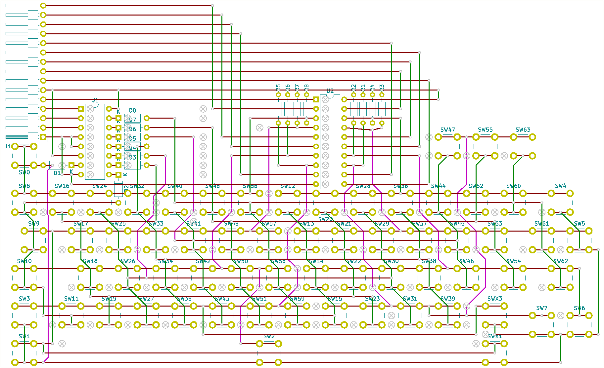

# George's homebrew keyboard

Schematics, board layouts, and code for adding a homebrew keyboard to your electronics projects

This one uses a parallel interface, ideal for connecting directly to the address and data bus of something like a 6502.

I also have one with a serial interface, more tailored for Arduino - let me know if you're interested and I'll publish it as a separate project.

# Schematic

# Bill of materials

* 8x resistor, 10k or thereabouts
* 8x diode, e.g. 1N4007
* 66x 4-pin push-switch with 5.08mmx5.08mm (0.2") pin pitch
* 1x 74LS138 address decoder
* 1x 74LS374 8-bit latch/register with tri-state outputs
* 1x 15-pin header for connecting wires (ideally horizontal, with bent pins)
* Veroboard - 39 tracks of 64 holes, or larger

# General operation

Connect:
* A0..A2 to the CPU's address bus
* D0..7 to the CPU's data bus
* PHI2 to the CPU's phi2 clock signal (the same one you use to time access to RAM, ROM, etc)
* ~OE to a combination of phi2, R/~W, and some address decoding logic

~OE needs to be kept high unless all of the following are true:
* phi2 is high (indicating the bus is active)
* R/~W is low (indicating a write cycle)
* high address pins map to keyboard I/O region

For the last one, my own 6502 computer simply uses an LS138 fed by the top three address lines, and one of the LS138's outputs drives this logic - the same way I generate chip-select signals for other memory-mapped parts of the computer.

Then the CPU can simply read from the mapped addresses.  The lowest address - for example, $a000 - corresponds to one "row" of keys; each bit is 1 if the corresponding key is not pressed, and 0 if it is pressed.  The next address, $a001, corresponds to the next "row", up to the final row at $a007.  The word "row" refers to the schematic, not the physical layout.

As an example, the shift keys correspond to bit 1 of $a000; the ctrl keys correspond to bit 3.  I think bit 0 is Esc, and bit 2 is the space bar.  $a001's bit 0 corresponds to the tilde/backtick key; bit 1 is probably tab or Q; bit 2 is A; and so on.  The exact layout was tweaked to make it easier to build on veroboard, while also ensuring that rollover works well with modifier keys in particular; as usual for this sort of thing, you need to do a lot more translation in software.

See the [kbd module](code/kbd.6502) which contains a full table of characters by row/column.

# Sample code

See [sample code](code/SampleCode.md) and [kbd module](code/kbd.6502).

# Board layout

The board layout shows the physical layout of the components.  The veroboard tracks run horizontally, and - where they are used - they are shown in dark red.  Green traces indicate fairly short links, mostly made with bare wire.  Pink traces indicate longer insulated wire links.  The (X) marks show where you need to break the existing veroboard tracks.

Some connections occur underneath switches, or pass entirely under a switch.  This doesn't always work well in practice, and I ended up routing some wires differently to this diagram.  It depends on the thickness of the wire and the physical shape of your switches.
