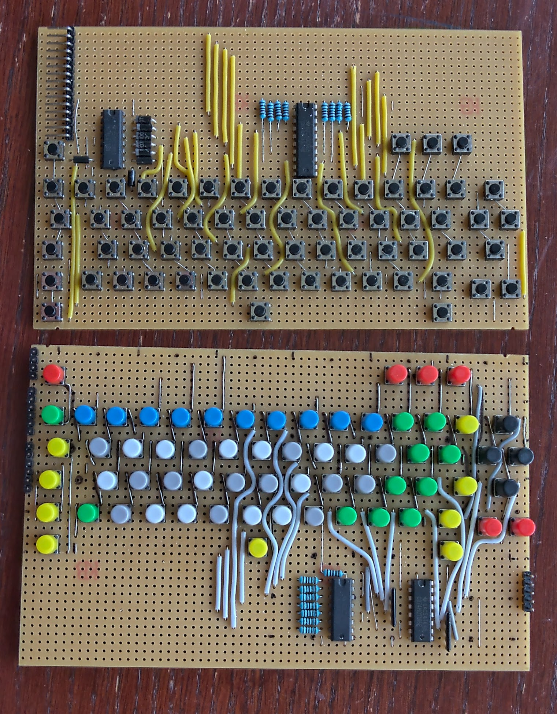
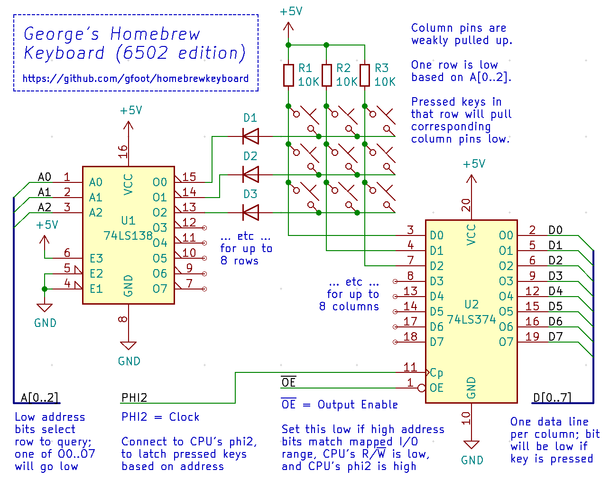

# George's homebrew keyboard

Schematics, board layouts, and code for adding a homebrew keyboard to your electronics projects

This one uses a parallel interface, ideal for connecting directly to the address and data bus of something like a 6502.

I also have one with a serial interface, more tailored for Arduino - let me know if you're interested and I'll publish it as a separate project.

